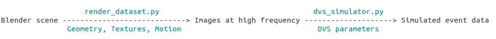

# DAVIS simulator

## We have released a much more powerful version of this event camera simulator. Check it out [here](https://github.com/uzh-rpg/rpg_esim).

## How does it work?

### Technical details

A DVS dataset is generated offline by a rendering engine (Blender in our case).
It contains a large number of images, obtained by raytracing along the camera trajectory with a very fine temporal resolution).

The data is stored as OpenEXR files, which contain the image data and depth maps as floating-point values in channels ('R', 'G', 'B'), 'Z' respectively.

*Note:* The intensity images are encoded in the linear color space (as opposed to sRGB color space). This is because the DVS work directly with irradiance values. It's important that the intensity images are encoded with floating-point accuracy to simulate correctly the high dynamic range of the DVS.

### Publication

If you use this software in an academic context, please cite the following publication:  
> E. Mueggler, H. Rebecq, G. Gallego, T. Delbruck, D. Scaramuzza:  
> **The Event-Camera Dataset and Simulator: Event-based Data for Pose Estimation, Visual Odometry, and SLAM.**  
> International Journal of Robotics Research, Vol. 36, Issue 2, pages 142-149, Feb. 2017.  
> [PDF (arXiv)](https://arxiv.org/pdf/1610.08336.pdf)

## What does the DAVIS simulator output?

The simulator will publish to the following topics:

- ``/dvs/events``: event stream
- ``/dvs/camera_info``: camera calibration
- ``/dvs/pose``: groundtruth transformation ``T_w_cam`` (transforms points from camera frame to world frame)
- ``/dvs/image_raw``: intensity image (grayscale, 8bits)
- ``/dvs/depth_map``: depth map (32bits floating-point)

## Compilation

### Dependencies

Checkout the necessary dependencies:

	cd $path_to_your_catkin_ws$/src

- rpg_dvs_ros (https://github.com/uzh-rpg/rpg_dvs_ros)

		git clone https://github.com/uzh-rpg/rpg_dvs_ros

- OpenEXR

We export images as EXR files because this format conveniently packages both the color and depth information with floating point accuracy. In order to read OpenEXR with python we need to install the following packages:

    sudo apt-get install libopenexr-dev
    cd $path_to_your_catkin_ws$/src
    wget http://excamera.com/files/OpenEXR-1.2.0.tar.gz -O - | tar -xz
    cd OpenEXR-1.2.0
    sudo python setup.py install

Read more about this openexr python package here: http://excamera.com/sphinx/articles-openexr.html  

- Install Blender
	
      sudo apt-get install blender

- Install Python3

      sudo apt-get install python3-dev python3-numpy python3-yaml

In ``/usr/lib/python3/dist-packages`` you should now have a ``yaml`` and ``numpy`` folder. This path is added in the ``scripts/prepare_dataset.py``.

### Building the simulator

    catkin build dvs_simulator_py
    
Source your catkin workspace (so that ROS registers the new package ``dvs_simulator_py``):

    source $path_to_your_catkin_ws$/devel/setup.bash
    
## Rendering a full dataset from a Blender scene

Two example launch files ``3walls_render.launch`` and ``3planes_render.launch`` are provided. To launch a rendering, use the following command:

    roslaunch dvs_simulator_py 3walls_render.launch
    
Two example Blender scenes ``3walls.blend`` and ``3planes.blend`` are provided for you to get started with. They are the scenes we used to generate the simulated data in the paper.
    
A new folder will be created in a sub-folder ``datasets/full_datasets/dataset_name`` containing all the necessary data to run the DVS simulator.

**Note**: if you installed Blender manually (instead of using apt-get), you need first to set the path to Blender in the file ``render_dataset.py``.

## Running the simulator

Two example launch files ``3walls_simulate.launch`` and ``3planes_simulate.launch`` are provided. They implement the parameters we used to generate the simulated data presented in the paper. You can launch the simulation as follows:

    roslaunch dvs_simulator_py 3walls_simulate.launch
    
If the parameter ``write_to_bag`` is set to *True*, a rosbag containing the simulated data will be written in ``datasets/rosbags``.

## FAQ

#### "I want to use an existing scene but be able to change the DVS parameters (contrast threshold, framerate of the APS, etc.)"

You need to generate or download a full DVS dataset first, and then roslaunch the dvs_simulator (dataset path and DVS parameters are set in the launch file).

#### "Where do I find the necessary data?"

- Full DVS datasets: in the ``datasets/full_datasets`` folder.
- Blender scenes: in the ``datasets/scenes`` folder.

#### "I want to change the [camera trajectory | camera calibration | scene geometry | textures]"

You need to change this directly in the Blender scene and then render the dataset again using ``render_dataset.py`` to produce a full dataset. You will then run the simulator on this new full dataset.

*Note:* you can provide the camera trajectory to ``render_dataset.py`` as a text file (with the argument 'trajectory_path' in the launch file, as illustrated in the launch file ``3planes_render.launch``.

#### "I want to create a new DVS dataset"

Create your scene into Blender and use render_dataset.py to render it.
Animate the camera using the standard Blender tools (keyframes, trajectory modifiers, etc.). You can also load a camera trajectory from a text file.

Note that there are a small number of requirements for the Blender synthesizer to work properly:

- the scene must contain *one* (and only one) camera named 'Camera'
- the camera used must be 'Perspective' (other types are not supported yet)
- 'First frame' and 'Last frame' values need to be set (they will be used to define the beginning/end of the dataset)

#### "What do the depthmaps contain?"

Depthmaps are encoded as 32-bit floating-point values.
The value encoded in the depth map depends on the render engine used by Blender. Most of the time, the 'Blender Render' engine is used.

- 'Blender Render' -> Depth along the optical axis (= Z-depth, fronto-parallel)
- 'Cycles' -> Euclidean depth (depth along the optical ray, for each pixel)

